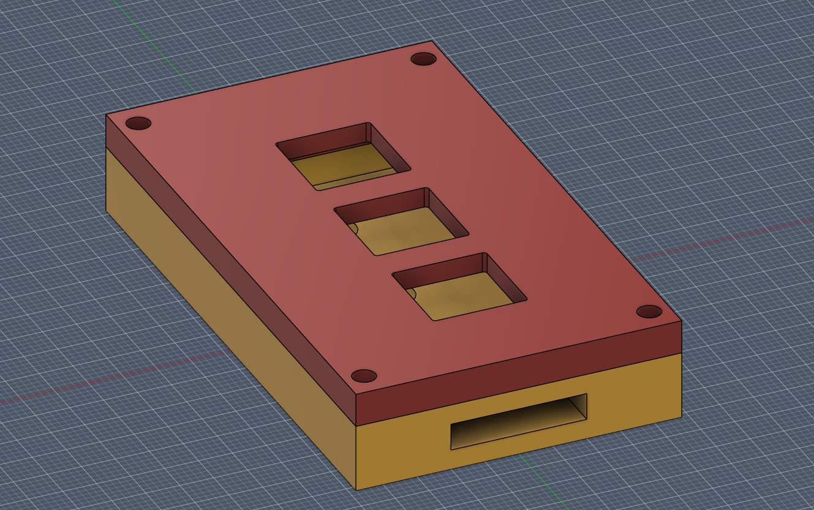
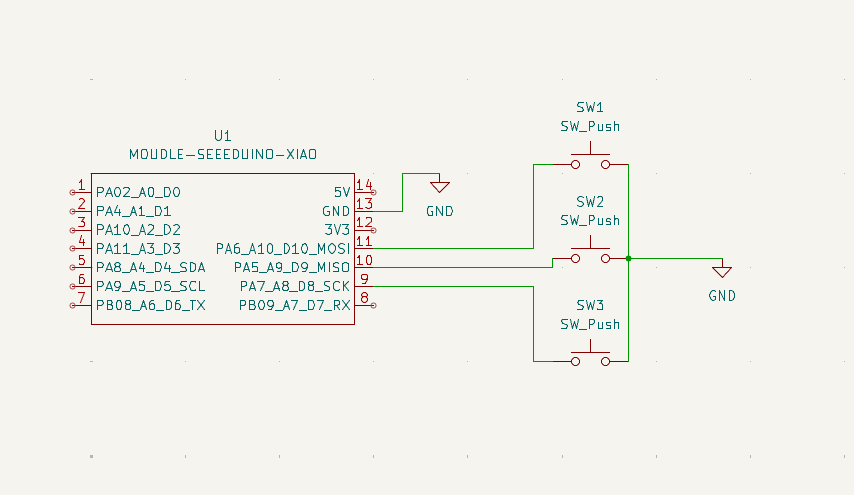
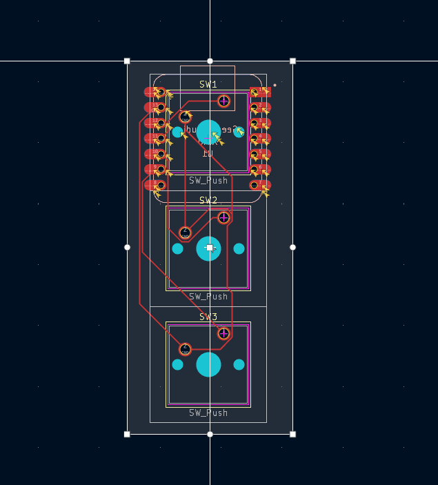
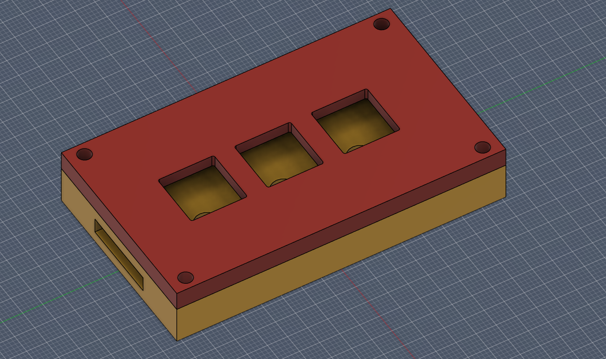

# abeer's macropad

A custom 3-key macropad built from scratch — PCB, case, and firmware — as part of Hack Club's hackpad program. The three keys map to **Copy, Paste, and Cut**, making it a handy little clipboard companion.

## Overview

| | |
|---|---|
| **Keys** | 3 (MX-style mechanical switches) |
| **Microcontroller** | Seeed XIAO RP2040 |
| **Firmware** | KMK (CircuitPython) |
| **Case** | Sandwich-mount, fully 3D-printed |
| **Wiring** | Direct (each switch to GND, no diodes) |

## What each key does

| Key | Action |
|-----|--------|
| SW1 | Copy (Ctrl+C) |
| SW2 | Paste (Ctrl+V) |
| SW3 | Cut (Ctrl+X) |

## Design

### Assembled render

### Schematic

### PCB layout

### 3D case

## Bill of Materials (BOM)

| Component | Qty | Source |
|-----------|-----|--------|
| Seeed XIAO RP2040 microcontroller | 1 | Kit |
| MX-style mechanical switch | 3 | Kit |
| Blank DSA keycap | 3 | Kit |
| M3 × 16 mm screw | 4 | Kit |
| M3 × 5 × 4 mm heatset insert | 4 | Kit |
| Custom PCB (2-layer, ~27 × 61 mm) | 1 | JLCPCB |
| 3D-printed top plate (Top.STEP) | 1 | Printing Legion |
| 3D-printed bottom shell (Bottom.STEP) | 1 | Printing Legion |

## Firmwar

Firmware is written in **KMK** (runs on CircuitPython).

To flash:
1. Install CircuitPython on the XIAO RP2040 (hold BOOT, plug in USB, drag the `.uf2` onto the `RPI-RP2` drive).
2. Copy the `kmk` folder onto the `CIRCUITPY` drive.
3. Copy `main.py` onto the `CIRCUITPY` drive.

The switches are wired directly to pins **D10, D9, D8** and GND, using internal pull-ups.

## Repository structure

    abeers-macropad/
    ├── README.md
    ├── CAD/
    │   └── assembled-model.STEP
    ├── PCB/
    │   ├── my_first_ever_ship.kicad_pro
    │   ├── my_first_ever_ship.kicad_sch
    │   └── my_first_ever_ship.kicad_pcb
    ├── Firmware/
    │   └── main.py
    ├── production/
    │   ├── gerbers.zip
    │   ├── Top.STEP
    │   ├── Bottom.STEP
    │   └── main.py
    └── screenshots/
        ├── render.png
        ├── schematic.png
        ├── pcb.png
        └── case.png
